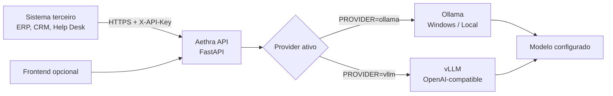

<div align="center">

# Aethra

### API de GenAI para transformar textos, e-mails, tickets, feedbacks e imagens em respostas úteis

[](https://www.python.org/)
[](https://fastapi.tiangolo.com/)
[](https://ollama.com/)
[](https://docs.vllm.ai/)
[](LICENSE)

**Aethra** é uma camada de serviços de Inteligência Artificial Generativa
construída com FastAPI. Ela disponibiliza endpoints HTTP para chat,
sumarização e análise multimodal, desacoplando os sistemas consumidores do
motor de inferência utilizado.

</div>

---

## Visão Geral

Aethra foi projetada para integrar recursos de GenAI a outros sistemas por
meio de uma API simples e configurável.

Casos de uso suportados:

- Resumo e priorização de e-mails.
- Resumo e explicação de tickets de atendimento.
- Interpretação de comentários e notas de NPS.
- Geração de respostas em linguagem natural.
- Descrição e análise de imagens por modelo multimodal.
- Integração backend-to-backend com autenticação por API key.

> Aethra não é um LLM. Aethra é a aplicação/API de GenAI; Ollama ou vLLM
> servem os modelos; modelos como Llama e LLaVA executam a geração.

## Recursos

| Recurso | Descrição |
| --- | --- |
| API-first | Endpoints FastAPI documentados e próprios para integração |
| Providers desacoplados | Suporte a Ollama e vLLM por variável de ambiente |
| Texto e visão | Rotas para chat, resumo e imagens em base64 |
| Segurança | `X-API-Key`, CORS configurável e Swagger desligável |
| Execução local | Ollama no Windows para desenvolvimento e pilotos |
| Escalabilidade futura | vLLM OpenAI-compatible para infraestrutura Linux/GPU |

## Arquitetura



### Fluxo recomendado para integração externa

```text
Sistema terceiro -> HTTPS + X-API-Key -> Tunnel/Proxy -> Aethra :8080 -> Ollama :11434
```

O Ollama deve permanecer privado, escutando apenas localmente. Sistemas
terceiros acessam somente a Aethra.

## Endpoints

| Método | Endpoint | Função | Autenticação quando `API_KEY` existe |
| --- | --- | --- | --- |
| `GET` | `/health` | Estado da API e do provider ativo | Pública |
| `POST` | `/chat` | Geração de respostas textuais | `X-API-Key` |
| `POST` | `/summarize` | Resumo e análise de textos | `X-API-Key` |
| `POST` | `/vision` | Interpretação de imagens | `X-API-Key` |
| `GET` | `/docs` | Swagger UI, se habilitado | Configurável |

## Stack

- Python 3.11+
- FastAPI e Pydantic
- Ollama para execução local no Windows
- vLLM para serving OpenAI-compatible em ambientes Linux/GPU adequados
- ngrok ou proxy HTTPS para acesso externo

## Estrutura Do Projeto

```text
Aethra/
|-- backend/
|   |-- .env.example
|   `-- app/
|       |-- config/
|       |   `-- config.py
|       |-- models/
|       |   `-- schemas.py
|       |-- providers/
|       |   |-- base.py
|       |   |-- factory.py
|       |   |-- ollama_provider.py
|       |   `-- vllm_provider.py
|       |-- routes/
|       |   |-- chat.py
|       |   |-- health.py
|       |   |-- summarize.py
|       |   `-- vision.py
|       |-- services/
|       |   |-- chat_service.py
|       |   |-- summarize_service.py
|       |   `-- vision_service.py
|       |-- main.py
|       `-- security.py
|-- deployment/
|   |-- .env.production.example
|   `-- Caddyfile.example
|-- frontend/
|-- requirements.txt
`-- README.md
```

## Início Rápido No Windows Com Ollama

Esta é a forma mais simples de executar a Aethra localmente.

### 1. Pré-requisitos

- Python 3.11 ou superior.
- [Ollama para Windows](https://ollama.com/download/windows).
- PowerShell.

### 2. Baixe os modelos

Para chat e resumo:

```powershell
ollama pull llama3.2:3b
```

Para análise de imagens:

```powershell
ollama pull llava:7b
```

Confira os modelos instalados:

```powershell
ollama list
```

### 3. Configure o ambiente local

Crie ou ajuste `backend/.env`:

```dotenv
ENVIRONMENT=development
CORS_ORIGINS=http://localhost:5500
ENABLE_DOCS=true

PROVIDER=ollama
OLLAMA_BASE_URL=http://127.0.0.1:11434
DEFAULT_CHAT_MODEL=llama3.2:3b
DEFAULT_VISION_MODEL=llava:7b
REQUEST_TIMEOUT=300

APP_NAME=Aethra API
APP_VERSION=1.0.0
APP_DESCRIPTION=API da Aethra para chat, resumo e visao
```

Em desenvolvimento, `API_KEY` pode ficar ausente para facilitar os testes
locais.

### 4. Instale e execute a API

Na raiz do projeto:

```powershell
python -m venv .venv
.\.venv\Scripts\Activate.ps1
pip install -r requirements.txt
uvicorn backend.app.main:app --reload --host 0.0.0.0 --port 8080
```

Abra:

- Swagger local: [http://localhost:8080/docs](http://localhost:8080/docs)
- Health check: [http://localhost:8080/health](http://localhost:8080/health)

Resposta esperada em `/health`:

```json
{
  "status": "ok",
  "api": "online",
  "provider": "ollama",
  "provider_status": "online",
  "default_chat_model": "llama3.2:3b",
  "default_vision_model": "llava:7b",
  "ollama": "online"
}
```

### 5. Execute o frontend opcional

Em outro terminal:

```powershell
cd frontend
python -m http.server 5500
```

Abra [http://localhost:5500](http://localhost:5500).

> O frontend atual é uma interface simples para chat. A rota `/vision` deve
> ser consumida diretamente pela API até que um upload de imagens seja
> implementado na interface.

## Utilização Da API

### Chat

```powershell
$body = @{
  pergunta = "Explique em poucas palavras o que é NPS."
  temperatura = 0.2
} | ConvertTo-Json

Invoke-RestMethod `
  -Uri "http://localhost:8080/chat" `
  -Method Post `
  -ContentType "application/json; charset=utf-8" `
  -Body ([Text.Encoding]::UTF8.GetBytes($body))
```

### Resumo De E-Mail

```powershell
$body = @{
  texto = @"
Assunto: Cobrança duplicada
De: cliente@empresa.com

Olá, identifiquei duas cobranças iguais em minha fatura deste mês.
Já abri um chamado há três dias, mas ainda não tive retorno.
Preciso que uma das cobranças seja estornada com urgência.
"@
  instrucoes = "Resuma este e-mail, informe prioridade e próxima ação."
} | ConvertTo-Json

$resposta = Invoke-RestMethod `
  -Uri "http://localhost:8080/summarize" `
  -Method Post `
  -ContentType "application/json; charset=utf-8" `
  -Body ([Text.Encoding]::UTF8.GetBytes($body))

$resposta.resposta
```

### Resumo A Partir De Arquivo

```powershell
$email = Get-Content "C:\Temp\email.txt" -Raw -Encoding UTF8

$body = @{
  texto = $email
  instrucoes = "Gere um resumo executivo, classifique urgência e sugira o próximo passo."
} | ConvertTo-Json

(Invoke-RestMethod `
  -Uri "http://localhost:8080/summarize" `
  -Method Post `
  -ContentType "application/json; charset=utf-8" `
  -Body ([Text.Encoding]::UTF8.GetBytes($body))).resposta
```

### Imagem

```powershell
$imagem = [Convert]::ToBase64String(
  [IO.File]::ReadAllBytes("C:\Temp\imagem.jpg")
)

$body = @{
  imagem_base64 = $imagem
  imagem_media_type = "image/jpeg"
  prompt = "Descreva a imagem e identifique informações relevantes."
} | ConvertTo-Json

(Invoke-RestMethod `
  -Uri "http://localhost:8080/vision" `
  -Method Post `
  -ContentType "application/json; charset=utf-8" `
  -Body ([Text.Encoding]::UTF8.GetBytes($body))).resposta
```

## Contratos JSON

### `POST /chat`

Requisição:

```json
{
  "pergunta": "Explique o motivo mais comum de churn.",
  "system_prompt": "Responda de forma objetiva em português do Brasil.",
  "temperatura": 0.2,
  "max_tokens": 300
}
```

### `POST /summarize`

Requisição:

```json
{
  "texto": "Conteúdo completo do e-mail, ticket ou feedback.",
  "instrucoes": "Resuma, classifique prioridade e indique próxima ação.",
  "max_tokens": 400
}
```

### `POST /vision`

Requisição:

```json
{
  "imagem_base64": "<BASE64_DA_IMAGEM>",
  "imagem_media_type": "image/jpeg",
  "prompt": "Descreva a imagem.",
  "max_tokens": 300
}
```

### Resposta Das Rotas Generativas

```json
{
  "status": "ok",
  "model": "llama3.2:3b",
  "resposta": "Texto gerado pelo modelo...",
  "metadados": {
    "provider": "ollama"
  }
}
```

## E-Mails Grandes

O conteúdo do e-mail deve ser enviado no corpo da requisição. Isso é esperado
em integrações de API. O limite relevante é a janela de contexto do modelo,
não a URL.

Para e-mails longos ou threads extensas, recomenda-se:

1. Remover HTML desnecessário, assinaturas repetidas e imagens embutidas.
2. Extrair assunto, remetente, data e corpo principal.
3. Dividir textos muito grandes em partes.
4. Resumir cada parte e gerar um resumo consolidado.

O processamento automático em partes ainda não está implementado nesta
versão da Aethra.

## Segurança E Produção

Quando `API_KEY` estiver configurada, as rotas `/chat`, `/summarize` e
`/vision` exigem o header:

```http
X-API-Key: SUA_CHAVE_PRIVADA
```

Em `ENVIRONMENT=production`, a aplicação:

- Exige uma `API_KEY` com pelo menos 32 caracteres.
- Rejeita `CORS_ORIGINS=*`.
- Pode ocultar Swagger e OpenAPI com `ENABLE_DOCS=false`.

### Gere uma chave segura

```powershell
$bytes = New-Object byte[] 32
[Security.Cryptography.RandomNumberGenerator]::Fill($bytes)
[Convert]::ToBase64String($bytes)
```

Nunca publique essa chave em documentação, commits, frontend ou mensagens.
Se uma chave for exibida publicamente, gere uma nova e substitua-a em todos
os consumidores.

### Configure produção com Ollama

Copie o template:

```powershell
Copy-Item deployment\.env.production.example backend\.env
```

Edite `backend/.env`:

```dotenv
ENVIRONMENT=production
API_KEY=<NOVA_CHAVE_SEGURA>
CORS_ORIGINS=
ENABLE_DOCS=false

PROVIDER=ollama
OLLAMA_BASE_URL=http://127.0.0.1:11434
DEFAULT_CHAT_MODEL=llama3.2:3b
DEFAULT_VISION_MODEL=llava:7b
REQUEST_TIMEOUT=300

APP_NAME=Aethra API
APP_VERSION=1.0.0
APP_DESCRIPTION=API da Aethra para chat, resumo e visao
```

O arquivo `backend/.env` contém segredo. Caso já tenha sido adicionado ao
Git em uma versão anterior, remova-o do índice antes de gravar chaves:

```powershell
git rm --cached backend/.env
```

Execute a API sem reload e exponha apenas localmente para o túnel ou proxy:

```powershell
uvicorn backend.app.main:app --host 127.0.0.1 --port 8080
```

## Publicação Sem Domínio Com Ngrok

Para piloto, demonstração ou baixo volume, o ngrok permite disponibilizar a
API por HTTPS sem comprar domínio.

### 1. Instale e autentique o ngrok

Baixe o agente para Windows:

- [ngrok para Windows](https://ngrok.com/download/windows/)

Configure seu token do ngrok:

```powershell
ngrok config add-authtoken "<AUTHTOKEN_DO_NGROK>"
```

### 2. Publique a API local

Com Ollama e Aethra rodando:

```powershell
ngrok http 8080
```

O ngrok exibirá uma URL HTTPS pública. Use a URL exibida pelo seu terminal;
ela não deve ser fixada no código do projeto.

### 3. Consuma externamente

```powershell
$url = "https://<URL_FORNECIDA_PELO_NGROK>"
$headers = @{
  "X-API-Key" = "<SUA_CHAVE_DA_AETHRA>"
  "ngrok-skip-browser-warning" = "1"
}

$body = @{
  texto = "Cliente informa cobrança duplicada e solicita estorno urgente."
  instrucoes = "Resuma o e-mail e informe prioridade."
} | ConvertTo-Json

(Invoke-RestMethod `
  -Uri "$url/summarize" `
  -Method Post `
  -Headers $headers `
  -ContentType "application/json; charset=utf-8" `
  -Body ([Text.Encoding]::UTF8.GetBytes($body))).resposta
```

O plano gratuito do ngrok é adequado para validação e operações pequenas,
mas possui limites de uso e não substitui hospedagem com SLA.

## Integração Em JavaScript

Este exemplo deve rodar em um backend, nunca em JavaScript entregue ao
navegador, pois contém a chave privada.

```javascript
const response = await fetch(`${process.env.AETHRA_URL}/summarize`, {
  method: "POST",
  headers: {
    "Content-Type": "application/json",
    "X-API-Key": process.env.AETHRA_API_KEY,
    "ngrok-skip-browser-warning": "1"
  },
  body: JSON.stringify({
    texto: emailContent,
    instrucoes: "Resuma o e-mail, informe prioridade e próxima ação."
  })
});

if (!response.ok) {
  throw new Error(`Aethra retornou HTTP ${response.status}`);
}

const result = await response.json();
console.log(result.resposta);
```

## Provider vLLM

Aethra também suporta vLLM por meio da API OpenAI-compatible:

- Health check do provider: `/v1/models`
- Geração e resumo: `/v1/chat/completions`
- Visão: mensagens multimodais OpenAI-style

Configuração:

```dotenv
PROVIDER=vllm
VLLM_BASE_URL=http://localhost:8000/v1
VLLM_API_KEY=EMPTY
DEFAULT_CHAT_MODEL=meta-llama/Llama-4-Scout-17B-16E-Instruct
DEFAULT_VISION_MODEL=meta-llama/Llama-4-Scout-17B-16E-Instruct
```

O vLLM é indicado para infraestrutura Linux com GPU adequada. Modelos
grandes, como Llama-4-Scout, exigem recursos significativamente superiores a
uma GPU de notebook e podem requerer pesos em formato compatível com serving.

## Troubleshooting

| Sintoma | Causa provável | Solução |
| --- | --- | --- |
| `/health` retorna `degraded` | Provider não está ativo | Inicie Ollama ou vLLM e confira o `.env` |
| `502 Bad Gateway` | Modelo/provider indisponível | Execute `ollama list`, baixe o modelo e reinicie a API |
| `401 Unauthorized` | API key ausente ou incorreta | Envie `X-API-Key` com a chave configurada |
| Erro ao analisar JSON com acentos | Encoding do PowerShell | Envie `UTF8.GetBytes($body)` e `charset=utf-8` |
| `/vision` demora muito | Modelo visual pesado para a GPU | Aguarde ou use hardware/modelo mais adequado |
| `GET /chat` retorna `405` | Rota aceita somente POST | Use `POST` com JSON no body |
| `/docs` retorna `404` | Docs desabilitada em produção | Use `ENABLE_DOCS=true` somente em ambiente controlado |

## Limitações Atuais E Próximos Passos

- O frontend atual atende chat simples; ainda não envia imagens.
- Não há chunking automático para e-mails muito longos.
- Não há integração direta com Outlook, Gmail ou filas de mensagens.
- Para uso crítico, ainda são recomendados rate limiting, auditoria,
  observabilidade, rotação de chaves e infraestrutura dedicada.

Evoluções naturais:

- Upload e processamento de arquivos `.eml` e `.txt`.
- Sumarização hierárquica de conversas extensas.
- Endpoints orientados a tickets e NPS com saída estruturada.
- Integração por `message_id` com provedores de e-mail.
- Métricas, logs de auditoria e limites por consumidor.

## Licença

Distribuído sob licença MIT. Consulte [LICENSE](LICENSE).
