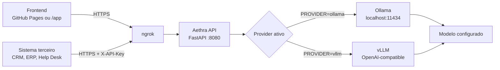

<div align="center">

# ✨ Aethra

### API de GenAI para chat, resumo de e-mails, tickets, NPS e visão multimodal

[](https://www.python.org/)
[](https://fastapi.tiangolo.com/)
[](https://ollama.com/)
[](https://docs.vllm.ai/)
[](LICENSE)

**Aethra** é uma API de Inteligência Artificial Generativa feita em **FastAPI**.
Ela recebe textos, e-mails, tickets, feedbacks e imagens por HTTP e repassa para
um provider de IA, como **Ollama** ou **vLLM**.

</div>

---

## 🧠 O Que É A Aethra?

Aethra é uma camada de backend para usar IA generativa em outros sistemas.

Ela não é o modelo em si. Pense assim:

```text
Seu sistema ou frontend
        ↓
Aethra API
        ↓
Provider de IA
        ↓
Modelo LLM ou multimodal
```

Hoje o projeto está preparado para:

- 💬 Chat e geração de texto.
- 📩 Resumo de e-mails.
- 🎫 Resumo e explicação de tickets.
- 📊 Análise de feedbacks e NPS.
- 🖼️ Análise de imagens com modelo multimodal.
- 🔐 Uso com ou sem API key.
- 🌐 Exposição online usando túnel HTTPS, como ngrok.

## ✅ Melhor Forma Gratuita Para Usar Online

Para o seu cenário atual, a forma mais simples e barata é:

```text
GitHub Pages
   ↓
Frontend estático
   ↓ HTTPS
ngrok
   ↓
Backend Aethra rodando no seu PC
   ↓
Ollama local
   ↓
Modelos llama3.2:3b e llava:7b
```

### Por que assim?

- ✅ GitHub Pages hospeda bem HTML, CSS e JS estáticos.
- ✅ ngrok cria uma URL HTTPS pública apontando para seu backend local.
- ✅ Ollama continua rodando no seu Windows, usando seus modelos locais.
- ✅ Você não precisa comprar domínio.
- ✅ Você evita pagar GPU em cloud.

### O que não recomendo agora

Hospedar o modelo pesado inteiro grátis no Hugging Face, Render ou Cloud Run
não é o melhor caminho para este projeto com Ollama local.

Motivo:

- GitHub Pages é apenas para site estático.
- Hugging Face Spaces aceita Docker/FastAPI, mas o plano grátis é CPU Basic.
- Modelos LLM locais precisam de RAM, CPU/GPU e tempo de execução estável.
- Ollama rodando em cloud grátis tende a ficar lento, instável ou inviável.

Se no futuro você quiser backend 100% cloud, o caminho ideal é trocar o
provider para uma API externa OpenAI-compatible ou usar vLLM em infraestrutura
com GPU.

## 🔗 Referências Oficiais

- GitHub Pages hospeda sites estáticos: [GitHub Pages Docs](https://docs.github.com/en/pages/getting-started-with-github-pages/about-github-pages)
- GitHub Pages publica arquivos HTML, CSS e JS do repositório: [Creating a GitHub Pages site](https://docs.github.com/en/pages/getting-started-with-github-pages/creating-a-github-pages-site)
- ngrok Free oferece um domínio dev automático para endpoints públicos: [ngrok Free Plan Limits](https://ngrok.com/docs/pricing-limits/free-plan-limits)
- Hugging Face Spaces suporta Docker e FastAPI na porta 7860: [Docker Spaces](https://huggingface.co/docs/hub/main/spaces-sdks-docker)
- Hugging Face Spaces grátis usa CPU Basic com 2 vCPU, 16 GB RAM e 50 GB de disco não persistente: [Spaces Overview](https://huggingface.co/docs/hub/main/en/spaces-overview)

## 🧱 Arquitetura



## 📁 Estrutura Do Projeto

```text
Aethra/
|-- backend/
|   |-- .env.example
|   `-- app/
|       |-- config/
|       |   `-- config.py
|       |-- models/
|       |   `-- schemas.py
|       |-- providers/
|       |   |-- base.py
|       |   |-- factory.py
|       |   |-- ollama_provider.py
|       |   `-- vllm_provider.py
|       |-- routes/
|       |   |-- chat.py
|       |   |-- health.py
|       |   |-- summarize.py
|       |   `-- vision.py
|       |-- services/
|       |   |-- chat_service.py
|       |   |-- summarize_service.py
|       |   `-- vision_service.py
|       |-- main.py
|       `-- security.py
|-- deployment/
|   |-- .env.production.example
|   `-- Caddyfile.example
|-- frontend/
|   |-- index.html
|   |-- script.js
|   |-- style.css
|   `-- assets/
|-- requirements.txt
`-- README.md
```

## 🚀 Rodando Localmente No Windows

### 1. Pré-requisitos

Instale:

- Python 3.11 ou superior.
- Ollama para Windows.
- PowerShell.
- ngrok, se quiser deixar online.

Confira o Python:

```powershell
python --version
```

Confira o Ollama:

```powershell
ollama --version
```

### 2. Baixe Os Modelos No Ollama

Modelo para chat e resumo:

```powershell
ollama pull llama3.2:3b
```

Modelo para visão:

```powershell
ollama pull llava:7b
```

Veja os modelos instalados:

```powershell
ollama list
```

### 3. Configure O `.env`

Crie o arquivo:

```powershell
Copy-Item backend\.env.example backend\.env
```

Para desenvolvimento local, deixe `backend/.env` assim:

```dotenv
ENVIRONMENT=development
AUTH_ENABLED=false
API_KEY=
CORS_ORIGINS=http://localhost:5500,http://127.0.0.1:8080
ENABLE_DOCS=true

FRONTEND_ENABLED=true
FRONTEND_DIR=frontend

PROVIDER=ollama
OLLAMA_BASE_URL=http://127.0.0.1:11434
DEFAULT_CHAT_MODEL=llama3.2:3b
DEFAULT_VISION_MODEL=llava:7b
REQUEST_TIMEOUT=300

APP_NAME=Aethra API
APP_VERSION=1.0.0
APP_DESCRIPTION=API da Aethra para chat, resumo e visão
```

> 🔐 Em uso local, `AUTH_ENABLED=false` facilita os testes. Para deixar online,
> use `AUTH_ENABLED=true`.

### 4. Instale As Dependências

Na raiz do projeto:

```powershell
python -m venv .venv
.\.venv\Scripts\Activate.ps1
pip install -r requirements.txt
```

### 5. Inicie O Backend

```powershell
uvicorn backend.app.main:app --reload --host 127.0.0.1 --port 8080
```

Abra no navegador:

- Painel web: [http://127.0.0.1:8080/app/](http://127.0.0.1:8080/app/)
- Health check: [http://127.0.0.1:8080/health](http://127.0.0.1:8080/health)
- Swagger local: [http://127.0.0.1:8080/docs](http://127.0.0.1:8080/docs)

Resposta esperada:

```json
{
  "status": "ok",
  "api": "online",
  "provider": "ollama",
  "provider_status": "online",
  "auth_enabled": false,
  "default_chat_model": "llama3.2:3b",
  "default_vision_model": "llava:7b",
  "ollama": "online"
}
```

## 🌎 Deixando Online Sem Comprar Domínio

Este é o caminho recomendado para você:

```text
Frontend no GitHub Pages
Backend no seu PC
ngrok expondo o backend com HTTPS
Ollama rodando local
```

### 1. Gere Uma API Key

No PowerShell:

```powershell
$bytes = New-Object byte[] 32
[Security.Cryptography.RandomNumberGenerator]::Fill($bytes)
[Convert]::ToBase64String($bytes)
```

Copie o valor gerado.

### 2. Configure Produção No Backend

Edite `backend/.env`:

```dotenv
ENVIRONMENT=production
AUTH_ENABLED=true
API_KEY=COLE_AQUI_SUA_CHAVE_GERADA
CORS_ORIGINS=https://SEU_USUARIO.github.io
ENABLE_DOCS=false

FRONTEND_ENABLED=true
FRONTEND_DIR=frontend

PROVIDER=ollama
OLLAMA_BASE_URL=http://127.0.0.1:11434
DEFAULT_CHAT_MODEL=llama3.2:3b
DEFAULT_VISION_MODEL=llava:7b
REQUEST_TIMEOUT=300

APP_NAME=Aethra API
APP_VERSION=1.0.0
APP_DESCRIPTION=API da Aethra para chat, resumo e visão
```

Se o seu GitHub Pages ficar em URL de projeto, use:

```dotenv
CORS_ORIGINS=https://SEU_USUARIO.github.io,https://SEU_USUARIO.github.io/NOME_DO_REPOSITORIO
```

> ⚠️ Nunca suba `backend/.env` para o GitHub.

### 3. Rode O Backend Em Modo Produção

```powershell
uvicorn backend.app.main:app --host 127.0.0.1 --port 8080
```

### 4. Inicie O ngrok

Em outro terminal:

```powershell
ngrok http http://127.0.0.1:8080
```

O ngrok vai mostrar algo parecido com:

```text
Forwarding  https://seu-endpoint.ngrok-free.dev -> http://localhost:8080
```

Essa URL HTTPS é a URL pública da sua API.

### 5. Teste Pela Internet

Troque a URL abaixo pela sua URL do ngrok:

```powershell
$url = "https://SEU_ENDPOINT.ngrok-free.dev"

$headers = @{
  "X-API-Key" = "SUA_API_KEY"
  "ngrok-skip-browser-warning" = "1"
}

$body = @{
  assunto = "Cobrança duplicada"
  remetente = "cliente@empresa.com"
  corpo = "Cliente informa cobrança duplicada e solicita estorno urgente."
  instrucoes = "Resuma o e-mail e informe prioridade."
} | ConvertTo-Json

(Invoke-RestMethod `
  -Uri "$url/summarize/email" `
  -Method Post `
  -Headers $headers `
  -ContentType "application/json; charset=utf-8" `
  -Body ([Text.Encoding]::UTF8.GetBytes($body))).resposta
```

## 🖥️ Publicando O Frontend No GitHub Pages

O frontend da Aethra está na pasta `frontend/`.

O GitHub Pages normalmente só deixa publicar a partir de:

- `/root`
- `/docs`

Como o projeto original usa a pasta `frontend/`, este repositório também tem
uma cópia pronta em `docs/`. Assim você pode publicar pelo GitHub Pages sem
precisar mover o backend.

### Opção Recomendada Neste Repositório

No GitHub, vá em:

```text
Settings → Pages → Build and deployment
```

Escolha:

```text
Source: Deploy from a branch
Branch: main
Folder: /docs
```

Depois clique em:

```text
Save
```

O GitHub vai gerar uma URL parecida com:

```text
https://SEU_USUARIO.github.io/NOME_DO_REPOSITORIO/
```

### Opção Com Repositório Separado

Outra forma é criar um repositório separado só para o front.

1. Crie um repositório no GitHub, por exemplo `aethra-front`.
2. Envie para esse repositório os arquivos dentro da pasta `frontend/`:
   - `index.html`
   - `style.css`
   - `script.js`
   - `assets/`
3. No GitHub, vá em:

```text
Settings → Pages → Build and deployment
```

4. Escolha:

```text
Source: Deploy from a branch
Branch: main
Folder: /root
```

5. O GitHub vai gerar uma URL parecida com:

```text
https://SEU_USUARIO.github.io/aethra-front/
```

### Configurando O Front Publicado

Abra o front no GitHub Pages e preencha:

```text
URL da API: https://SEU_ENDPOINT.ngrok-free.dev
X-API-Key: SUA_API_KEY
```

Marque:

```text
Enviar header auxiliar do ngrok
```

Depois clique em:

```text
Aplicar
```

Pronto. O front no GitHub Pages vai chamar o backend que está rodando no seu PC.

## 🧪 Testando A API

### Health

```powershell
Invoke-RestMethod -Uri "http://127.0.0.1:8080/health"
```

Com ngrok:

```powershell
Invoke-RestMethod `
  -Uri "https://SEU_ENDPOINT.ngrok-free.dev/health" `
  -Headers @{ "ngrok-skip-browser-warning" = "1" }
```

### Chat

```powershell
$body = @{
  pergunta = "Explique o que é NPS em poucas palavras."
  temperatura = 0.2
} | ConvertTo-Json

Invoke-RestMethod `
  -Uri "http://127.0.0.1:8080/chat" `
  -Method Post `
  -ContentType "application/json; charset=utf-8" `
  -Body ([Text.Encoding]::UTF8.GetBytes($body))
```

### Resumo De E-Mail

```powershell
$body = @{
  assunto = "Problema com pagamento"
  remetente = "cliente@empresa.com"
  corpo = @"
Olá, identifiquei duas cobranças iguais em minha fatura deste mês.
Já abri um chamado há três dias, mas ainda não tive retorno.
Preciso que uma das cobranças seja estornada com urgência.
"@
  instrucoes = "Resuma este e-mail, informe prioridade e próxima ação."
} | ConvertTo-Json

$resposta = Invoke-RestMethod `
  -Uri "http://127.0.0.1:8080/summarize/email" `
  -Method Post `
  -ContentType "application/json; charset=utf-8" `
  -Body ([Text.Encoding]::UTF8.GetBytes($body))

$resposta.resposta
```

### Resumo De Texto Geral

```powershell
$body = @{
  texto = "Cliente deu nota NPS 3 e reclamou de atraso no suporte."
  instrucoes = "Explique o sentimento, risco e ação recomendada."
} | ConvertTo-Json

(Invoke-RestMethod `
  -Uri "http://127.0.0.1:8080/summarize" `
  -Method Post `
  -ContentType "application/json; charset=utf-8" `
  -Body ([Text.Encoding]::UTF8.GetBytes($body))).resposta
```

### Vision

```powershell
$imagem = [Convert]::ToBase64String(
  [IO.File]::ReadAllBytes("C:\Temp\imagem.jpg")
)

$body = @{
  imagem_base64 = $imagem
  imagem_media_type = "image/jpeg"
  prompt = "Descreva a imagem e identifique informações relevantes."
} | ConvertTo-Json

(Invoke-RestMethod `
  -Uri "http://127.0.0.1:8080/vision" `
  -Method Post `
  -ContentType "application/json; charset=utf-8" `
  -Body ([Text.Encoding]::UTF8.GetBytes($body))).resposta
```

## 📡 Endpoints

| Método | Endpoint | Função | Auth |
| --- | --- | --- | --- |
| `GET` | `/health` | Status da API e do provider | Público |
| `POST` | `/chat` | Geração de texto e conversa | `X-API-Key` se auth ativa |
| `POST` | `/summarize` | Resumo de texto geral, ticket ou NPS | `X-API-Key` se auth ativa |
| `POST` | `/summarize/email` | Resumo facilitado de e-mail | `X-API-Key` se auth ativa |
| `POST` | `/vision` | Análise de imagem base64 | `X-API-Key` se auth ativa |
| `GET` | `/app/` | Frontend local servido pelo backend | Depende da configuração |
| `GET` | `/docs` | Swagger UI | Só se `ENABLE_DOCS=true` |

## 📦 Contratos JSON

### `POST /chat`

```json
{
  "pergunta": "Explique o motivo mais comum de churn.",
  "system_prompt": "Responda de forma objetiva em português do Brasil.",
  "temperatura": 0.2,
  "max_tokens": 300
}
```

### `POST /summarize`

```json
{
  "texto": "Conteúdo completo do ticket, NPS ou texto geral.",
  "instrucoes": "Resuma, classifique prioridade e indique próxima ação.",
  "max_tokens": 700
}
```

### `POST /summarize/email`

Aceita `corpo`, `texto` ou `body`.

```json
{
  "assunto": "Cobrança duplicada",
  "remetente": "cliente@empresa.com",
  "corpo": "Corpo completo do e-mail.",
  "instrucoes": "Resuma, informe prioridade e próxima ação.",
  "max_tokens": 700
}
```

### `POST /vision`

```json
{
  "imagem_base64": "<BASE64_DA_IMAGEM>",
  "imagem_media_type": "image/jpeg",
  "prompt": "Descreva a imagem.",
  "max_tokens": 300
}
```

### Resposta Padrão

```json
{
  "status": "ok",
  "model": "llama3.2:3b",
  "resposta": "Texto gerado pelo modelo...",
  "metadados": {
    "provider": "ollama"
  }
}
```

## 🔐 Segurança

### Modo Local Simples

```dotenv
AUTH_ENABLED=false
API_KEY=
```

Use somente localmente ou em rede confiável.

### Modo Online Recomendado

```dotenv
AUTH_ENABLED=true
API_KEY=SUA_CHAVE_GRANDE_E_SECRETA
```

Nesse modo, envie sempre:

```http
X-API-Key: SUA_CHAVE_GRANDE_E_SECRETA
```

### Cuidados Importantes

- 🚫 Não coloque API key no GitHub.
- 🚫 Não coloque API key fixa em frontend público.
- ✅ Para testes pessoais no front, digite a key no campo da tela.
- ✅ Se uma key vazou, gere outra.
- ✅ Deixe `ENABLE_DOCS=false` em produção.
- ✅ Configure `CORS_ORIGINS` com a URL real do seu GitHub Pages.

## 🧰 Comandos Rápidos

Use três terminais.

### Terminal 1: Ollama

```powershell
ollama serve
```

Se o Ollama já estiver rodando como serviço, esse comando pode não ser
necessário.

### Terminal 2: Backend

```powershell
cd "D:\Modelos LLMs\Aethra"
.\.venv\Scripts\Activate.ps1
uvicorn backend.app.main:app --host 127.0.0.1 --port 8080
```

### Terminal 3: ngrok

```powershell
ngrok http http://127.0.0.1:8080
```

## 🧠 Provider vLLM

Aethra também suporta vLLM com API compatível com OpenAI.

Exemplo:

```dotenv
PROVIDER=vllm
VLLM_BASE_URL=http://localhost:8000/v1
VLLM_API_KEY=EMPTY
DEFAULT_CHAT_MODEL=meta-llama/Llama-4-Scout-17B-16E-Instruct
DEFAULT_VISION_MODEL=meta-llama/Llama-4-Scout-17B-16E-Instruct
```

Exemplo de execução do vLLM:

```powershell
vllm serve "D:\Modelos LLMs\Llama-4-Scout-17B-16E-Instruct" --host 0.0.0.0 --port 8000
```

> ⚠️ vLLM é mais indicado em Linux com GPU adequada. Para Windows local,
> Ollama é o caminho mais simples.

## 🧯 Troubleshooting

| Problema | Causa provável | Como resolver |
| --- | --- | --- |
| `/health` mostra `degraded` | Ollama ou vLLM offline | Abra o Ollama e confira `ollama list` |
| `provider_status` está `offline` | URL do provider errada | Confira `OLLAMA_BASE_URL` ou `VLLM_BASE_URL` |
| `502 Bad Gateway` | Modelo não respondeu | Baixe o modelo com `ollama pull` e reinicie a API |
| `401 Unauthorized` | API key ausente ou incorreta | Envie `X-API-Key` correta |
| Front no GitHub Pages não chama API | CORS bloqueando | Configure `CORS_ORIGINS` com a URL do GitHub Pages |
| Front chama `localhost` no GitHub Pages | URL da API errada na tela | Coloque a URL HTTPS do ngrok no campo `URL da API` |
| ngrok mostra tela de aviso | Interstitial do plano grátis | Envie header `ngrok-skip-browser-warning: 1` |
| Acentos quebrados no PowerShell | Encoding incorreto | Use `charset=utf-8` e `UTF8.GetBytes($body)` |
| `/docs` retorna 404 | Docs desativada | Use `ENABLE_DOCS=true` apenas em ambiente local |
| `GET /chat` retorna 405 | Rota aceita POST | Use `POST` com JSON no body |
| Resumo demora muito | Modelo local lento | Aguarde ou use modelo menor |

## 🚧 Limitações Atuais

- Não existe chunking automático para e-mails gigantes.
- O front público não deve guardar API key em código.
- O ngrok grátis tem limites mensais.
- Para SLA real, use VPS, Cloud Run, Render pago, GPU cloud ou provider externo.
- Para modelos grandes como Llama-4-Scout, use infraestrutura adequada.

## 🗺️ Próximos Passos Naturais

- 📄 Upload de `.txt`, `.eml` e PDFs.
- 🧩 Chunking automático para textos longos.
- 🎫 Endpoint dedicado para tickets.
- 📊 Endpoint dedicado para NPS com saída estruturada.
- 📈 Logs, métricas e auditoria.
- 🚦 Rate limit por consumidor.
- 🔁 Rotação de API keys.
- 🐳 Dockerfile pronto para deploy.

## 📜 Licença

Distribuído sob licença MIT. Consulte [LICENSE](LICENSE).
